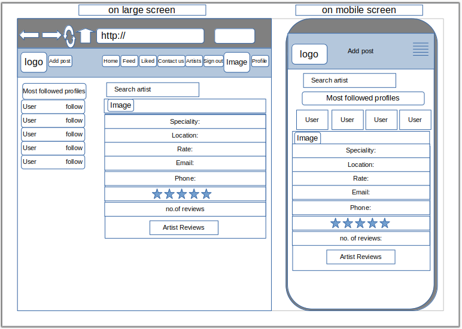

# My-events 
My-events project is a Full Stack website built using Django Rest framework and Reactjs. This website is built to enable users to share and post photos of special events online and make reactions to other posts. Users need to register an account in order to share their photos. When a user registered, an account is creatted with a user profile that will be dedicated for the user to upload profile biography and profile image. Users can then upload and share their photos and make reviews on others uploaded photos that belong to another user. 

[Live Project Available Here](https://myeventsapp-8aa7e839ed16.herokuapp.com/)

## Table of Contents
* [My-events Social Media](#my-events-social-media)
* [Table of Content](#table-of-contents)
* [Backend Django-Rest-Framework](#backend-django-rest-framework)
  * [Main Goals](#main-goals)
  * [Agile Methodology Plane](#agile-methodology-plane)
    * [Epics](#epics)
    * [User Stories](#user-stories)
  * [API Endpoints](#api-endpoints)
  * [Database Design](#database-design)
  * [Security](#security)
  * [Technologies](#technologies)
  * [Python Packages](#python-packages)
  * [Testing Backend code](#testing-backend-code)
* [Frontend React-js](#frontend-react-js)
  * [The Strategic Design](#the-strategic-design)
    * [Website Objectives](#website-objectives)
    * [Agile Strategy](#agile-strategy)
  * [Epics Frontend](#epics-frontend)
  * [User Stories Frontend](#user-stories-frontend)
  * [The Architectural Scheme](#the-architectural-scheme)
  * [The Skeleton Plane](#the-skeleton-plane)
    * [Wireframes](#wireframes)
  * [Frontend Technologies](#frontend-technologies)
  * [Clone the repository code locally](#clone-the-repository-code-locally)
  * [Testing Frontend App](#testing-frontend-app)
  * [Deployment](#deployment)
    * [Repository](#repository)
    * [Hosting on Heroku](#hosting-on-heroku)
  * [Credits](#credits)

# Backend Django-Rest-Framework 
Django Rest Framework is the backend API service used for [Events Social Media](https://github.com/bky201/events-api.git). This section is mainly used for data storage, receiving requests from the client side and sending back a responses to client/webpage to render the webpage.

## Main Goals

The main goal of this website is to develop social media website that can provide event's photo sharing with other users online and get back rating and reviews from other users. This can make it easy for users to follow up their freinds and get more information about users they follow. 

## Agile Methodology Plane 

The foundation of this project is built upon Agile methodologies, where each project feature is delivered during a specific sprint. This project consists of two sprints, with stories being allocated to epics for better organization. The workflow is managed through a [Kanban board](https://github.com/users/bky201/projects/12) created using GitHub Projects. It's worth noting that all stories come with a comprehensive set of well-defined conditions or requirements that must be met for a user story to be considered complete and ready for evaluation. 

### Epics 

**Set Up**

This epic encompasses all the initial preparations needed to set up the Django application and Django REST Framework, laying the foundation for the development of project features.

**Artists**

This epic includes the creation of all API endpoints and database connections required for implementing the CRUD (Create, Read, Update, Delete) functionality for users who register as Artists.

**Comments**

This epic encompasses the development of all API endpoints and database connections necessary for implementing CRUD (Create, Read, Update, Delete) functionality for user comments in the context of posts.

**Posts**

This epic includes the creation of all API endpoints and database connections required for implementing CRUD (Create, Read, Update, Delete) functionality for user posts, which also encompasses handling like activities.

**Profiles**

This epic encompasses the development of all API endpoints and database connections necessary for implementing CRUD (Create, Read, Update, Delete) functionality for user-created profiles, which also includes the functionality for following other users.

**Contacts**

This epic includes the development of all API endpoints and database connections required for implementing CRUD (Create, Read, Update, Delete) functionality for User contacts, which is displayed on admin pannel.

**Reviews**

This epic includes the development of all API endpoints and database connections required for implementing CRUD (Create, Read, Update, Delete) functionality for Artist reviews and the calculation of an average rating, which is displayed on user profiles.

 

### User Stories

**Based on Epics** 

**Setup**

* As a developer I can set up a new project environment so that it is ready for developing in a separate environment.

* As a developer I can deploy the website into heroku so that it is available and accessible online.

**Profiles API**

* As a developer I can build a user profile so that I can assign it a default image profile.

* As a user I can list all profiles so that I can view and interact with available profiles content.

* As a user I can edit a profile so that I can add content to my profile.

**Posts API**

* As a user, I want to create a post so that I can add post to list of posts online.

* As a user, I want to manage a post so that I can edit or delete a post.

* As a user I can add and edit a comment so that I can interact to posts.

**Likes API**

* As a user, I want to like a post so that I can express my appreciation for content.

**Followers API**

* As a user, I want to follow a user so that I can get new content from the user instantly.

**Artists API**

* As a developer, I want to create artists api views so that users can follow.

**Contact API**

* As a developer, I want to create message API view so that users can contact the site owner with issues.

**Review API**

* As a user, I want to rate an artist so that users can share my rating and review.

## API Endpoints

User Story:

    As a developer I can set up a new project environment so that it is ready for developing in a separate environment.

Implementation:

The initial project setup involved creating a base project and establishing a virtual environment with all the necessary packages installed and then freezing these packages into the requirements.

Additionally, the settings were modified to conceal any sensitive variables and to distinguish between the development and production environments.

User Story:

    As a developer I can deploy the website into heroku so that it is available and accessible online.

Implementation:

The initial project was deployed and hosted on Heroku to make the website accessible online. This allowed to track and address errors at an early stage of development.

User Story:

    As a developer I can build a user profile so that I can assign it a default image profile.
 

    As a user I can list all profiles so that I can view and interact with available profiles content.

Implementation:

  | Methods| Endpoint   | purpose  |
  | -------|:----------:| -----|
  | POST   | /profiles/ | Create user profile  |
  | GET    | /profiles/ | Retrieve a list of profiles |

User Story:

    As a user I can edit a profile so that I can add content to my profile.

Implementation:

  | Methods| Endpoint   | purpose |
  |-------|:----------:| -----|
  | GET   | /profiles/`<int:pk>`/ | view a profile  |
  | PUT   | /profiles/`<int:pk>`/ | update a profile |
  | DELETE| /profiles/`<int:pk>`/ | delete a profile |

User Story:

    As a user, I want to create a post so that I can add post to list of posts online.

Implementation:

  | Methods| Endpoint   | purpose  |
  | -------|:----------:| -----|
  | POST   | /posts/ | Create a post  |
  | GET    | /posts/ | Retrieve a list of posts |

User Story:

    As a user, I want to manage a post so that I can edit or delete a post.

Implementation:

  | Methods| Endpoint   | purpose |
  |-------|:----------:| -----|
  | GET   | /posts/`<int:pk>`/ | view a post  |
  | PUT   | /posts/`<int:pk>`/ | update a post |
  | DELETE| /posts/`<int:pk>`/ | delete a post |

User Story:

    As a user, I want to like a post so that I can express my appreciation for content.

Implementation:

  | Methods| Endpoint   | purpose  |
  | -------|:----------:| -----|
  | POST   | /likes/ | Create a like  |
  | GET    | /likes/ | Retrieve a list of likes |
  | DELETE| /likes/`<int:pk>`/ | remove a like |

User Story:

    As a user, I want to follow a user so that I can get new content from the user instantly.

Implementation:

  | Methods| Endpoint   | purpose  |
  | -------|:----------:| -----|
  | POST   | /follows/ | Create a follower  |
  | GET    | /follows/ | Retrieve a list of follower |
  | DELETE| /follows/`<int:pk>`/ | unfollow a user |

User Story:

    As a developer, I want to create artists api views so that users can follow.

Implementation:

  | Methods| Endpoint   | purpose  |
  | -------|:----------:| -----|
  | POST   | /artists/ | Create an artist  |
  | GET    | /artists/ | Retrieve a list of artists |
  | PUT   | /artists/`<int:pk>`/ | update an artists |
  | GET   | /artists/`<int:pk>`/ | view an artists  |
  | DELETE| /artists/`<int:pk>`/ | remove an artist |

User Story:

    As a developer, I want to create message API view so that users can contact the site owner with issues.

Implementation:

  | Methods| Endpoint   | purpose  |
  | -------|:----------:| -----|
  | POST   | /contacts/ | Create a contact  |
  | GET    | /contacts/ | Retrieve a list of contacts |
  | PUT   | /contacts/`<int:pk>`/ | update a contact |
  | GET   | /contacts/`<int:pk>`/ | view a contact  |
  | DELETE| /contacts/`<int:pk>`/ | remove a contact |

User Story:

    As a user, I want to rate an artist so that users can share my rating and review.

Implementation:

  | Methods| Endpoint   | purpose  |
  | -------|:----------:| -----|
  | POST   | /reviews/ | Create a review  |
  | GET    | /reviews/ | Retrieve a list of reviews |
  | PUT   | /reviews/`<int:pk>`/ | update a review |
  | GET   | /reviews/`<int:pk>`/ | view a review  |
  | DELETE| /reviews/`<int:pk>`/ | remove a review |

## Database Design

## Security

"IsOwnerOrReadOnly" a permissions class was introduced with the purpose of allowing only content creators to modify or delete the content.

Environment variables were stored in an env.py for local development for security purposes to ensure no secret keys, api keys or sensitive information was added the the repository. In production, these variables were added to the heroku config vars within the project.

## Technologies

* Python 
  * Python is the programming language applied to design this application.
* Visual Studio Code
  * Visual Studio Code IDE tool was utilized in building the website. 
* Git
  * The source code of the Website was regularly committed and pushed during its development using Git.  
* GitHub
  * The source code of the website is accessible on GitHub, and it has been uploaded using Git Pages.  
* Heroku
    * Used for hosting the application
* Cloudinary
    * Used for static image hosting

 

## Python Packages

 Details of packages 

* dj-database-url==2.1.0
    * Used to parse the DATABASE_URL connection settings
* dj-rest-auth==2.1.9
    * Used with auth system
* Django==4.2.5
    * Main framework used to start the project
* django-allauth==0.54.0
    * Used for authentication
* django-cors-headers==4.2.0
    * Used for Cross-Origin Resource Sharing (CORS) headers to responses
* django-filter==23.3
    * Used to filter API results in serializers
* dj3-cloudinary-storage==0.0.6
    * Used to help connect with the cloudinary storage 
* cloudinary==1.34.0
    * Used to help connect with the cloudinary storage 
* django-on-heroku==1.1.2
    * Used to help connect with the heroku
* djangorestframework==3.14.0
    * Framework used to build the API endpoints
* djangorestframework-simplejwt==5.3.0
    * Used with djange rest framework to create access tokens for authentication
* gunicorn==21.2.0
    * Used for deployment of WSGI applications
* Pillow==10.0.0
    * Imaging Libray - used for image uploading
* psycopg2==2.9.7
    * PostgreSQL database adapter to allow deployed application to perform crud on the postgresql db
* PyJWT==2.8.0
    * For creating the Python Json Web Tokens for authentication
* urllib3==1.26.16
    * For retrying requests and dealing with HTTP redirects
  * whitenoise==6.5.0
    * For serving static files with Python

Installed as package dependcies include the following:
* asgiref==3.7.2
* certifi==2023.7.22
* cffi==1.15.1
* charset-normalizer==3.2.0
* cryptography==41.0.3
* defusedxml==0.7.1
* idna==3.4
* oauthlib==3.2.2
* packaging==23.1
* psycopg2-binary==2.9.7
* pycparser==2.21
* python3-openid==3.2.0
* pytz==2023.3.post1
* requests==2.31.0
* requests-oauthlib==1.3.1
* six==1.16.0
* sqlparse==0.4.4
* typing_extensions==4.7.1

 

## Testing Backend code

Posts App Unit tests 

While API testing was conducted locally during development, the primary testing phase was integrated into the front-end repositories. Testing involved manual interactions with the actual APIs, such as submitting form inputs and loading pages.

**Validation Results**

The flake8 tool was utilized to analyze all directories. Numerous problems surfaced due to different causes, including excessive line lengths, extraneous white spaces, improper indentation, and issues with docstrings.

Every problem was successfully addressed, except for the lengthy lines found in migration files, which are auto-generated and therefore not altered. Additionally, the auth validator lines within the settings.py file, constituting framework code, proved unmodifiable.

 

 

 

 

 

 

 

 

 

# Frontend React-js 

## The Strategic Design

### Website Objectives

My-events is designed for various events and occasions. The website's purpose is to link users with past and special events, enabling them to memorize the enjoyable moments they experienced. Artists' events and informations can be shared and delivered to followers very easly.

### Agile Strategy

Agile methodologies were employed in the development of this project, with the approach of delivering small features through gradual sprints. A total of three sprints were conducted, evenly distributed across a span of three weeks.

This project consists of sprints, with stories being allocated to epics for better organization. The workflow is managed through a [Kanban board events-app](https://github.com/users/bky201/projects/14) created using GitHub Projects. Each user story is accompanied by a thorough and precisely outlined set of criteria or prerequisites that need to be fulfilled to deem the user story as finished and prepared for assessment. 

## Epics Frontend

**Set Up**

This Epic encompasses all the preliminary steps for setting up the React application and its dependencies, laying the foundation for feature development.

**Posts**

This epic pertains to the development of the application's frontend specifically for managing posts. Its purpose is to enable users to engage with the backend API through the user interface, facilitating the creation, reading, updating, and deletion of their own posts.

**Comments**

This epic focuses on the frontend development of the application with respect to commenting on posts. Its objective is to enable users to engage with the backend API to include comments on posts.

**Profiles**

This epic addresses the frontend development of the application concerning user profiles. Its aim is to provide users with the capability to interact with the backend API through the user interface for the purpose of managing their personal profiles.

**Artists**

This epic encompasses the frontend development of the application with a focus on artists. Its objective is to enable users to interact with the backend API, allowing them to register or unregister themselves as artists and showcase their artist-related information.

**Reviews**

This epic involves the frontend development of the application concerning artist reviews. Its purpose is to enable users to interact with the backend API through the user interface, facilitating the process of leaving reviews on specific artists.

 

## User Stories Frontend

By Epic:

**Setup**

* As a developer I can set up a new workspace so that it is ready for developing an application.

* As a developer I can deploy the website into heroku so that it is available and accessible online.

**Navigation & Authentication**

* Navigation: As a user I want to be able to navigate between pages so that I can access every page content.

* Routing: As a user I can navigate between pages instantly so that I can view content  without page refresh.

* Sign up: As a user I can create a new account so that I can access all the features for signed up users.

* Sign in: As a user I can sign in to the app so that I can access functionality for logged in users.

* Logged in Status: As a user I can see my logged in status so that I can log in or log out. 

**Posts**

* Create posts: As a logged in user I can post images so that I can share my images with other users.

* View a post: As a user I can view the details of a post so that I can get more information.

* Like a post: As a logged in user I can like a post so that I can express my appreciation and interest for a post.

* View recent posts: As a user I can see recent posts that are ordered by most recently created first so that I can view the newest content.

* Search for Posts: As a user I can search for posts using search-key, so that I can find the posts and user profiles I want to view.

* Filter liked posts: As a logged in user I can retrieve all the posts I liked so that I can review the all the posts I like.

* Filter posts of followed users: As a logged in user I can view posts filtered by users I follow so that I can get the latest post they are posting about.

* Infinite scroll: As a user I can keep scrolling down for new images on the site, that are loaded automatically so that I don't have to go to "next page" for new images.

* Post page detail: As a user I can view the posts page so that I can read the comments about the post.

* Edit post: As a post owner I can edit my post title and description so that I can make modification or update my post after it was created.

* Delete Post: As a post owner I can delete my post so that I can remove a post that I do not want to keep.

**Comments**

* Create a comment: As a logged in user I can put my comment to a post so that I can share my opinion on the post.

* Comment date: As a user I can see created date of a comment so that I know how long a comment was made.

* View comments: As a user I can read comments made on a post so that I can find out what users think about the post.

* Delete comments: As a comment owner I can delete my comment so that I can remove a comment that I do not want to keep.

* Edit a comment: As an owner of a comment I can modify my comment so that I can correct or change it according to my interest.

**Profiles**

* Profile page: As a user I can view other users profiles so that I can see their posts and learn more about them.

* Most followed profiles: As a user I can see a list of the most followed profiles so that I can see which profiles are popular.

* User profile Details: As a user I can view details such as user-bio, number of posts, follows and users followed so that I can get a quick overview about users.

* Follow/Unfollow a user: As a logged in user I can follow and unfollow a user profile so that I can get updated posts by users in my posts feed board.

* View all posts by selecting a user: As a user I can view posts related to a user so that I can filter their latest posts I want to follow.

* Edit profile: As a logged in user I can edit my profile so that I can change my profile picture and bio.

* change username and password: As a logged in user I can modify my username and password so that I can secure my display name and profile.

**Artists**

* Create Artist Profile: As an artist, I can register my details so that other users can view my work and contact details.

* View Artist Profile : As a user, I can view artist details so that I can find artists with their latest work.

* View Artists Post: As a user I can view all recent artists posts so that I am up to date with the newest posts.

* Artist Review and Rating:  As a user, I can give a rating to an artist so that others can see my review and rating.

**Contacts**

* Contact: As a user, I can write message to contact the site owner so that I can report any issues.

 

## The Architectural Scheme

### Functionality:

**Setup**

User Story:

    As a developer I can set up a new project environment so that it is ready for development in a local environment.

Implementation:

The initial project setup involved creating a base project and establishing a working space with all the necessary packages installed.

User Story:

    As a developer I can deploy the website into heroku so that it is available and accessible online.

Implementation:

The initial project was deployed and hosted on Heroku to make the website accessible on production. This allowed to track and address errors at an early stage of development.

**Navigation & Authentication**

    As a user I want to be able to navigate between pages so that I can access every page content.

Implementation:

Navigation menu has been implemented across the website for a user to access the website with different status a logged in user and a logged out user.

This will allow the navigation between pages on the website from any device. Access of the Nav items varies based on the respnivesness of the website to the device size.

Logged out state:

A loogged out user will have access to the following navigation bar:

   * Home
   * Sign In
   * Sign Up

Logged in state:

A loogged out user will have access to the following navigation bar:

   * Home  
   * Feed
   * Liked
   * Contact Us
   * Artists
   * Sign out
   * Profile

User Story:

    As a user I can create a new account so that I can access all the features for signed up users.

Implementation:

A "Sign Up" option in a navbar was created using a UI element, that allows users to navigate to a registration page. This component allow users to input their registration details (e.g., username, password) and submit the form.

User Story:
    
    As a user I can sign in to the app so that I can access functionality for logged in users.

Implementation:

A "Sign In" option in a navbar was created using a UI element, that allows users to navigate to a sign-in or login page. This component allow users to input their login credentials (e.g., username, password) and submit the form.

 
    
    As a user I can see my logged in status so that I can log in or log out. 

Implementation: 

A logged-in user is redirected to access different components or page content in the website by implementing username/password authentication, such as token-based authentication (JWT). Authenticated user is can render  different pages such as Add post, Home page, Feed, Liked page, Artists page and sign out link.

**Posts**

User Story:

    As a logged in user I can post images so that I can share my images with other users.

Implementation:

Add Post button has been included in the navigation bar in order for logged in users to add a post or an image. This will allow a user to  share an event with other users.

User Story:

    As a user I can view the details of a post so that I can get more information.

Implementation:

A user can access the post detail page by clicking on the post. This will allow the user to access all the details about post page.

User Story:

    As a logged in user I can like a post so that I can express my appreciation and interest for a post.

Implementation:

Authenticated users possess complete privileges to create posts, leave comments, like, or dislike content. This safeguards the interaction with other users' posts on the website, permitting engagement exclusively for registered users.

User Story:

    As a user I can see recent posts that are ordered by most recently created first so that I can view the newest content.

Implementaton:

The content of the posts is arranged with the most recent posts displayed at the top of the page. This arrangement simplifies the process for users to access the latest content without the need to actively search or filter for it.

User Story:

    As a user I can search for posts using search-key, so that I can find the posts and user profiles I want to view.

Implementation:

Users can search for posts by entering a keyword into the search bar, enabling them to filter out posts that contain similar keywords and find content that aligns with their interests.

User Story:

    As a logged in user I can retrieve all the posts I liked so that I can review the all the posts I like.

Implementation:

Users have the ability to refine post content by filtering it based on the items they have liked. They can do this by selecting the "liked" option in the navigation menu to display all the posts they have previously liked.

User Story:

    As a logged in user I can view posts filtered by users I follow so that I can get the latest post they are posting about.

Implementation:

Users have the ability to refine post content by filtering it based on the user they have followed. They can do this by selecting the "Feed" option in the navigation menu to display all the posts they have followed their owner.

User Story:

    As a user I can keep scrolling down for new images on the site, that are loaded automatically so that I don't have to go to "next page" for new images.

Implementation:

An infinite scrolling component has been integrated to load posts. It dynamically adds a new page of 10 posts as the user reaches the bottom of the scroll, continuously extending the content. This approach ensures swift content display and enhances the website's accessibility.

User Story:

    As a post owner I can edit my post title and description so that I can make modification or update my post after it was created.

Implementation:

Users have the ability to edit a post content by selecting the "edit" option in the post menu to edit any post they have added.

User Story:

    As a post owner I can delete my post so that I can remove a post that I do not want to keep.

Implementation:

Users have the ability to delete a post content by selecting the "delete" option in the post menu to delete any post they have added.

**Comments**

User Story:

    As a logged in user I can put my comment to a post so that I can share my opinion on the post.

Implementation:

Users have the ability to add comment to a post content by selecting the "comment" option in the post bottom menu.

User Story:

    As a user I can see created date of a comment so that I know how long a comment was made.

Implementation:

Users have the ability to see how long a comment is created by the user to a post content in the comments list.

User Story:

    As a comment owner I can delete my comment so that I can remove a comment that I do not want to keep.

Implementation:

Users have the ability to delete a comment content by selecting the "delete" option in the comment menu to delete any comment they have added.

User Story:

    As an owner of a comment I can modify my comment so that I can correct or change it according to my interest.

Implementation:

Users have the ability to edit a comment content by selecting the "edit" option in the comment menu to edit any comment they have added.

**Profiles**

User Story:

    As a user I can view other users profiles so that I can see their posts and learn more about them.

Implementation:

User profile page is implemented and can be viewed by clicking on the Avatar shown in a post. Where as a logged in users can view their own profile by clicking the icon from the navigation menu.

User Story:

    View all posts by selecting a user: As a user I can view posts related to a user so that I can filter their latest posts I want to follow.

Implementation:

Profile page of a user contains all details and posts related to the user. All posts related to a user can be viewed by clicking on the Avatar shown in a post. 

User Story:

    As a logged in user I can edit my profile so that I can change my profile picture and bio.

Implementation:

Profile page of a user contains a three dot menu which includes the edit button. A user can edit a profile by selecting this edit option shown on the profile page.

User Story:

    As a logged in user I can modify my username and password so that I can secure my display name and profile.

Implementation:

Profile page of a user contains a three dot menu which includes the change password button. A user can change a password by selecting this edit option shown on the profile page.

User Story:

        As a user I can see a list of the most followed profiles so that I can see which profiles are popular.

Implementation:

The most followed users is shown in a component in the ascending order of order that shows a followed profiles on the top of all profiles on a separate component. 

User Story:

        Follow/Unfollow a user: As a logged in user I can follow and unfollow a user profile so that I can get updated posts by users in my posts feed board.

Implementation:

A user can follow or unfollow other user by clicking button that shows follow/unfollow in user profile.

User Story:

        As a user I can view details such as user-bio, number of posts, follows and users followed so that I can get a quick overview about users.

Implementation:

A user can view more details about the user profile by clicking on user avatar to see  user-bio, number of posts, follows and users followed the user profile.

**Artists**

User Story:

    As an artist, I can register my details so that other users can view my work and contact details.

Implementation:

Artists can register as an artist on their profile page by clicking the 3 dots menu on the profile detail page. By select the option "register as artist" will enable the user to fill out the artist detail form.

User Story:

    As a user, I can view artist details so that I can find artists with their latest work.

Implementation:

Users can view Artist detail information by clicking the artists option on the navigation bar. This will allow users to view the artists user profile.

User Story:

    As a user, I can give a rating to an artist so that others can see my review and rating.

Implementation:

"Leave a review" option on the artists detail page enable users to leave the number of star rating and a review they want to give for the artist. Stars will highligh to yellow color based on the numbers the users have selected. 

The artist's average rating is shown on the artist profile page which is the total sum of all ratings and divided by the number of users that have rated the artist.

**Contacts**

User Story:

        Contact: As a user, I can write message to contact the site owner so that I can report any issues.

Implementation:

A "Contact Us" option in a navbar was created using a UI element, that allows users to navigate to a contact us page. This component allow users to contact the site owner and input their contact message (e.g., Reason for contacting us, detail) and submit the form.

### Future Functionality

As a future functionality, a chat component will be implemented to allow online users to open chat area with artists online.

As a future functionality I would like to include a sport events and schedules component for users who love to attend and participate in sport evets. 

 

## The-Skeleton-Plane

### Wireframes

All Wireframe Images

Home / Posts

Feed

Liked

Profiles

Contact

Artist List

Artist Profile

Create Artist & Edit Artist

Create Post & Edit Post

Sign In

Sign Up

### Typography

The main font used on the website is "DM Sans" with fall back sans-serif text.

### Imagery

The website's logo was created using a FREE LOGO online tool, thoughtfully incorporating the color blue to establish a distinct and memorable visual. 

The website's images were sourced from Pixabay a reputable platforms offering a wide selection of royalty-free images.

#### Colour-Scheme

The background colour for individual componenets is white (#ffffff).

Main text is black (#000000). 

The main page background colour is an off shade of white (#f8f8f8).

## Frontend Technologies

* React
    * Main framework used to create the user interface
* Node
    * Package manager used to install dependencies
* Heroku
    * Used for application hosting
* Git
    * Version control software
* Github
    * Repository used to store base code and docs

 

## Testing Frontend App

Testing results are available in the [TESTING.md file](./TESTING.md)

## Deployment

### Repository

The website was developed using the Visual Studio code editor and uploaded to the remote repository named 'events-api' on GitHub.

During the development process, the following Git commands were utilized to push the code to the remote repository:

1. `git add [file]` command was utilized to include the file(s) in the staging area prior to committing them.
2. `git commit -m [commit message]` command was employed to record and save the changes made to the local repository, preparing them for the final step.
3. `git push` command was utilized to upload all committed code to the remote repository on GitHub.

### Hosting on Heroku

* The website was successfully published on Heroku applications. The deployment process involved the following steps:
  * Open Heroku website and click "New" to create a new app.
  * Create an app name and region region, click "Create app".
  * Click "Settings" and click Config Vars. Add the following config variables:
    * PORT: 8000
    * SECRET_KEY: (Your secret key)
    * DATABASE_URL: (This include the database)
    * CLOUDINARY_URL: (This include the cloudinary storage url)
    * ALLOWED_HOST
    * CLIENT_ORIGIN: The URL for the React-based client frontend application that will be used to send requests to these APIs.
    * CLIENT_ORIGIN_DEV: The address of the local server employed for previewing and testing the user interface (UI) while developing the frontend client application.

  * Select Buildpacks and add buildpacks for Python and NodeJS (in that order).
  * Click to "Deploy". Select the deployment type to Github and enter repository name and connect.
  * At the bottom of the page go to Manual Deploy, select "main" branch and select "Deploy Branch".
  * Once completed successfully, after waiting for some time the app will be deployed to heroku. 
  
## Clone the repository code locally

To create a local copy of the repository code by cloning it just do the following steps:

  * Navigate to the GitHub Repository that you want to clone locally, and then click on the dropdown button labeled "Code".
  * Click on "HTTPS" and copy the link.
  * Open your IDE and install git.
  * On your cmd line write git clone "your https link".

## Credits 

The implementation of the simple star rating component was obtained from [awran5/react-simple-star-rating](https://github.com/awran5/react-simple-star-rating)

I would like to thank Gareth McGirr. His work [body-doodles](https://github.com/Gareth-McGirr/body-doodles.git) was a great inspiration for me to complete my project.

Code Institute for Full stack development.
[online classes ](https://learn.codeinstitute.net/login?next=/).

