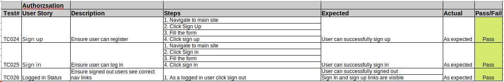
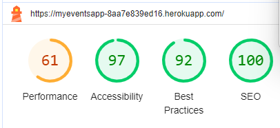

# User Story Testing

[Document can be viewed here]()

## Posts

## Profiles

## Comments

## Auth

## Contact

## Unit Tests

Unit tests were created for the navbar module

## Lighthouse Testing

Lighthouse was used to test the website for auditing and improving various aspects of web performance, accessibility, best practices, and SEO. Lighthouse audits provide valuable insights, but it's important to combine them with other SEO and web development best practices for a comprehensive approach to optimizing the website's performance, accessibility, best practices, and search engine ranking. Regularly monitoring and improving the site to ensure it meets evolving standards and user expectations.

## Responsiveness

All pages were tested to ensure responsiveness on screen sizes from 320px and upwards as defined in WCAG 2.1 Reflow criteria for responsive design on Firefox, Chrome, Edge and Opera browsers.

Steps to test:

* Open the website on the browser
* Right click on the browser and select inspect to open the developer tools
* Select a responsive option and adjust the width to 320px
* Select 50% zoom screen
* change the responsive window width to the maximum width

Expected:

Website showed responsive on all screen sizes and all the images are propertionaly adjusted to screen size. There is no horizontal additionalscrolling. 

Actual:

Website rendered as expected.

## Validators

All CSS files were validated and no Error was found.

## Bugs and their fixes

